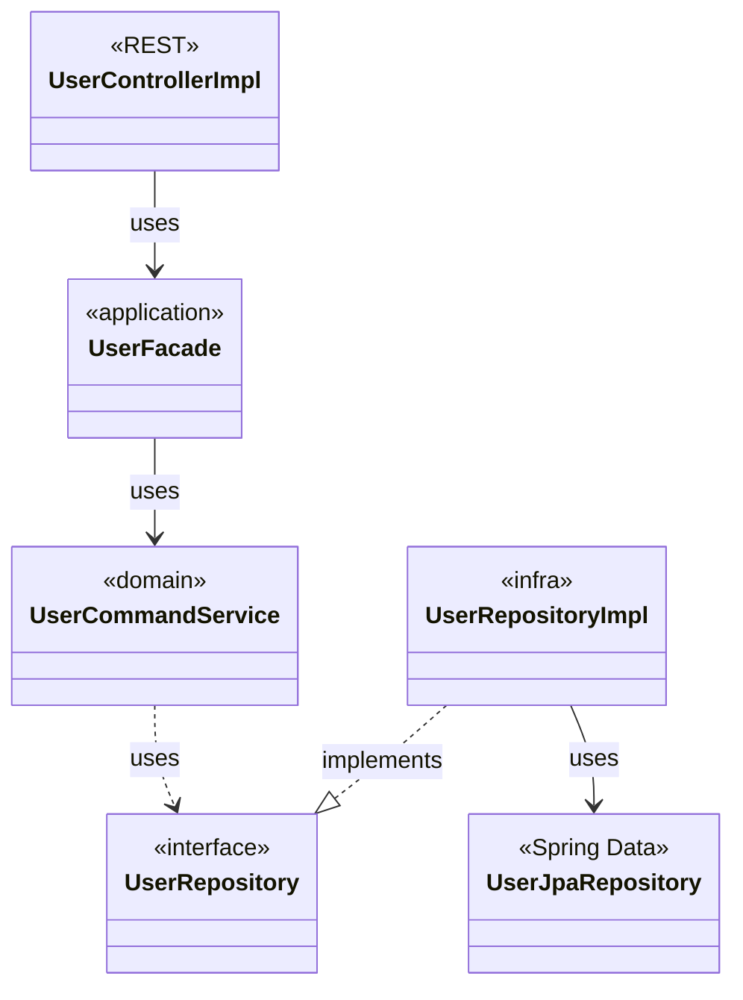
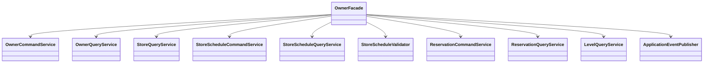
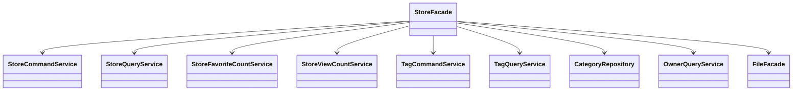
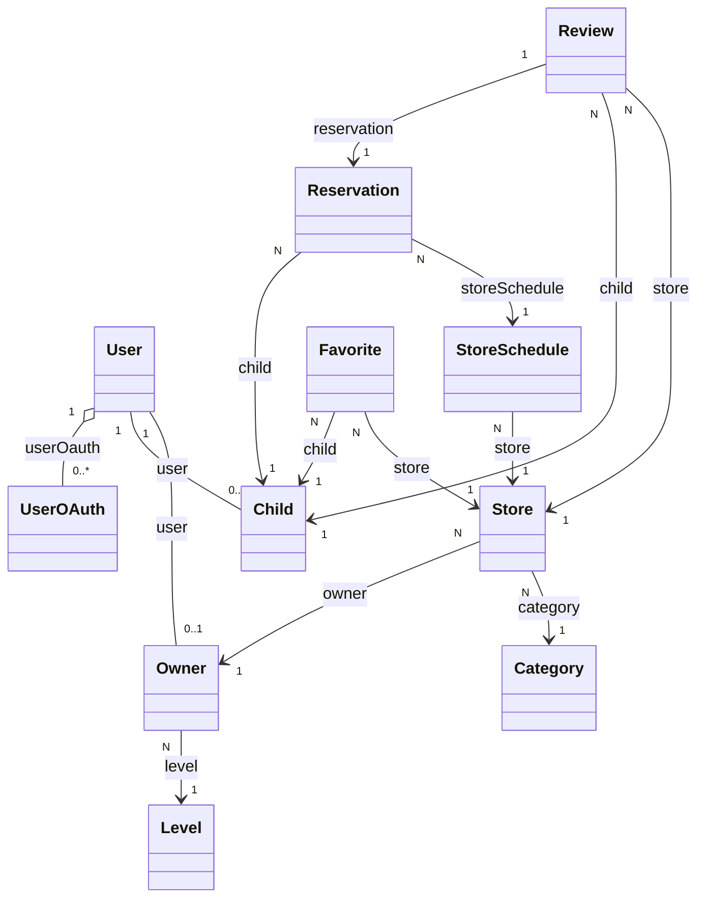

# 클래스 다이어그램 (onharu-backend-v2)

> **주의:** 아래 다이어그램은 **의존 관계를 익히기 위한 개략도**이다. 필드·메서드 전체를 나열하지 않으며, 실제 코드는 각 클래스 소스가 우선이다.  
> 이전 **영화 예매·대기열·지갑** 등 **다른 프로젝트**용 다이어그램은 **본 레포와 무관**하므로 제거했다.

관련 문서: `docs/DOMAIN_ARCHITECTURE.md`, `docs/PROJECT_STRUCTURE.md`.

---

## 1. 레이어와 의존 방향 (개요)

- **도메인**은 **`UserRepository` 같은 포트(인터페이스)** 에만 의존하고, **구현(`UserRepositoryImpl` + `UserJpaRepository`)** 은 **infra**에 둔다.

---

## 2. `UserFacade` 주요 협력 객체

`UserFacade` 는 회원가입·로그인·프로필·소셜 연동 등에서 **여러 도메인 서비스**와 **`FileFacade`·`NotificationFacade`** 를 조합한다.

```mermaid
classDiagram
    class UserFacade
    class UserCommandService
    class UserQueryService
    class UserOAuthCommandService
    class UserOAuthQueryService
    class ChildCommandService
    class ChildQueryService
    class OwnerCommandService
    class OwnerQueryService
    class LevelCommandService
    class LevelQueryService
    class StoreQueryService
    class FileFacade
    class NotificationFacade
    class PasswordEncoder

    UserFacade --> UserCommandService
    UserFacade --> UserQueryService
    UserFacade --> UserOAuthCommandService
    UserFacade --> UserOAuthQueryService
    UserFacade --> ChildCommandService
    UserFacade --> ChildQueryService
    UserFacade --> OwnerCommandService
    UserFacade --> OwnerQueryService
    UserFacade --> LevelCommandService
    UserFacade --> LevelQueryService
    UserFacade --> StoreQueryService
    UserFacade --> FileFacade
    UserFacade --> NotificationFacade
    UserFacade --> PasswordEncoder
```

---

## 3. `ChildFacade` — 예약·찜·이벤트·락

결식 아동 유스케이스는 **`Reservation*Service`** 와 **`DistributeLockExecutor`**, **`ApplicationEventPublisher`** (`ReservationEvent`) 를 함께 쓴다.

```mermaid
classDiagram
    class ChildFacade
    class ChildQueryService
    class ReservationCommandService
    class ReservationQueryService
    class ReservationTransactionService
    class StoreQueryService
    class StoreFavoriteCountService
    class FavoriteCommandService
    class FavoriteQueryService
    class ReviewQueryService
    class ApplicationEventPublisher
    class DistributeLockExecutor

    ChildFacade --> ChildQueryService
    ChildFacade --> ReservationCommandService
    ChildFacade --> ReservationQueryService
    ChildFacade --> ReservationTransactionService
    ChildFacade --> StoreQueryService
    ChildFacade --> StoreFavoriteCountService
    ChildFacade --> FavoriteCommandService
    ChildFacade --> FavoriteQueryService
    ChildFacade --> ReviewQueryService
    ChildFacade --> ApplicationEventPublisher
    ChildFacade --> DistributeLockExecutor
```

---

## 4. `OwnerFacade` — 가게·스케줄·예약 처리

사업자 유스케이스는 **`StoreSchedule*Service`**, **`Reservation*Service`**, **`StoreScheduleValidator`**, **`ApplicationEventPublisher`** 가 핵심 협력 객체다.

---

## 5. `StoreFacade` — 가게·태그·조회수

가게 검색·등록·수정·태그·캐시 무효화 등에서 **`Store*Service`**, **`Tag*Service`**, **`CategoryRepository`** 등을 사용한다.

---

## 6. 핵심 도메인 엔티티 관계 (요약)

JPA 엔티티 간 **연관**만 표시한다. 공통 **`BaseEntity`** (`id`, 감사 필드) 는 생략.

---

## 7. 존재하지 않는 타입 (본 레포)

다음은 **이 저장소에 없는 개념**이므로 다이어그램에서 제외했다.

- `WaitingQueueFacade`, `MovieFacade`, `TheaterFacade`
- `Wallet`, `WaitingQueue`, `Movie`, `TheaterSeat`, `Payment` (영화 예매 맥락)
- `PricingContext`, `DiscountPolicy` 등 가격 도메인

추가로 다른 `*Facade`·서비스 관계를 보고 싶다면 `application` 패키지의 클래스를 열어 **필드 목록(`private final …`)** 을 보면 된다.
