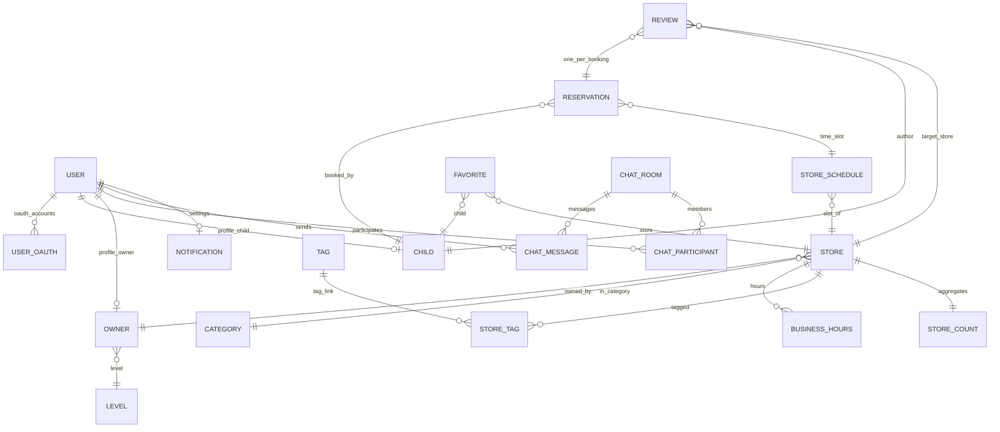

# 도메인 아키텍처 (onharu-backend-v2)

본 문서는 **`domain` 패키지의 JPA 엔티티·서비스·리포지토리 인터페이스**와, **`application`(`*Facade`)·`event`·`infra`** 와의 역할 분담을 코드 기준으로 정리한다.  
이전에 **영화관·좌석·지갑·가격 정책(Pricing)** 등 **다른 프로젝트**를 설명하던 내용은 **본 시스템과 무관**하므로 사용하지 않는다.

---

## 1. 비즈니스 맥락

- **사용자(`User`)** 는 `UserType` 으로 **아동(CHILD)·사업자(OWNER)·관리자(ADMIN)** 등을 구분한다.
- **결식 아동**은 `Child` 로 **사용자 1:1 프로필**을 가지며, **가게(`Store`)** 의 **일정 슬롯(`StoreSchedule`)** 에 **예약(`Reservation`)** 을 신청한다.
- **사업자(`Owner`)** 역시 `User` 와 **1:1** 이며, **등급(`Level`)** 을 참조하고 **가게·스케줄·예약 처리(확정·완료·취소)** 를 담당한다.
- **감사 리뷰(`Review`)** 는 **예약 1건당 최대 1개(Reservation 유니크)** 로 연결된다.
- **찜(`Favorite`)** 은 **아동–가게** 조합이 유일하다(`UK_FAVORITE_CHILD_STORE`).
- **파일(`File`)** 은 S3/MinIO 저장 후 **메타데이터만 DB**에 두며, `refType` + `refId` 로 게시물 유형에 붙인다.

HTTP 경로·인증 방식은 **`docs/API_SPEC.md`** 를 본다.

---

## 2. 레이어링과 의존 방향

```mermaid
flowchart TB
  subgraph interfaces["interfaces.api"]
    C["REST Controller"]
    S["@Scheduled 스케줄러"]
  end
  subgraph application["application"]
    F["*Facade"]
  end
  subgraph domain["domain"]
    M["model / enum"]
    DS["*CommandService / *QueryService"]
    RP["*Repository 인터페이스"]
  end
  subgraph infra["infra"]
    JPA["JPA Entity + *RepositoryImpl"]
    R["Redis / Redisson / 외부 HTTP"]
  end
  C --> F
  S --> DS
  F --> DS
  F --> RP
  DS --> RP
  JPA -.-> M
  RP <.. JPA : implements
  DS --> M
  F --> M
```

- **`domain`**: 비즈니스 규칙·엔티티·**포트**(리포지토리 인터페이스). 가능한 한 **프레임워크에 덜 의존**(예외·에러 타입은 `support.error`).
- **`application`**: 유스케이스 조립. 여러 도메인 서비스와 트랜잭션 경계를 **`@Transactional` 이 붙은 `*Facade`** 에 두는 경우가 많다.
- **`infra`**: JPA 구현체, Redis, OAuth, 메일, NTS, WebSocket 등 **어댑터**.
- **`interfaces`**: HTTP 매핑, 전역 예외(`ApiControllerAdvice`), 스케줄러 진입점.

---

## 3. 핵심 도메인 모델 (`domain/*/model`)

JPA 엔티티는 대부분 **`BaseEntity`** (`id`, 감사 필드)를 상속한다.

| 구분 | 엔티티(요약) | 역할 |
|------|----------------|------|
| **계정·신원** | `User`, `UserOAuth` | 로그인·역할·상태·소셜 연동 목록 |
| **프로필** | `Child`, `Owner` | `User` 와 **1:1** — 아동 닉네임·승인 여부 / 사업자 번호·등급·나눔 횟수 등 |
| **등급·분류** | `Level`, `Category`, `Tag`, `StoreTag` | 사업자 등급, 가게 카테고리, 태그(다대다는 `StoreTag`) |
| **가게** | `Store`, `BusinessHours`, `StoreCount` | `Owner`·`Category` 소속, 영업시간·태그, **조회수/찜 수 등 집계**( `StoreCount` 는 `Store` 와 **1:1**, PK=FK) |
| **일정** | `StoreSchedule` | 가게별 날짜·시간대·정원; **예약 가능 여부** 판정 로직 포함 |
| **예약** | `Reservation` | `Child` + `StoreSchedule` 에 **다대일** 연결, 상태(`ReservationType`)·인원·취소 정보 |
| **리뷰·찜** | `Review`, `Favorite` | 리뷰는 **예약 1:1**; 찜은 **아동–가게** 유니크 |
| **채팅** | `ChatRoom`, `ChatMessage`, `ChatParticipant` | 방–메시지–참가자(`User`); 일대일/그룹 등 `RoomType` |
| **알림** | `Notification`, `NotificationHistory` | 사용자별 알림 설정·히스토리 |
| **파일·메일** | `File`, `EmailAuthentication` | 파일 메타·이메일 인증 코드 등 |

**존재하지 않는 도메인 (본 레포):** `Movie`, `Theater`, `TheaterSeat`, `Wallet`, `PricingContext` / `DiscountPolicy` 등.

---

## 4. 주요 엔티티 관계 (요약 ER)



---

## 5. 유스케이스 경계 (개념적 “애그리거트”)

DDD 용어를 엄격히 쓰기보다, **코드에서 응집도가 큰 묶음**을 다음처럼 볼 수 있다.

1. **예약 흐름**  
   `StoreSchedule`(가용 슬롯) → `Reservation` 생성/상태 전이(WAITING·CONFIRMED·COMPLETED·CANCELED 등) → 필요 시 `ReservationEvent` 로 알림.
2. **가게 노출**  
   `Store` + `BusinessHours` + `StoreTag` + `StoreCount`(찜·조회수) + `File`(이미지 ref).
3. **리뷰**  
   완료된 예약에 대해 `Review` 1건; `Reservation` 과 **1:1**.
4. **채팅**  
   `ChatRoom` 중심으로 `ChatParticipant`·`ChatMessage` 가 생명주기를 공유. Kafka에 노출할 채팅 이벤트는 **`OutboxEvent`**(`outbox_events`)에 적재한 뒤 인프라 릴레이가 브로커로 전송한다(설정·흐름: `docs/chat-kafka-flow.md`).

---

## 6. 도메인 이벤트·비동기·인프라 횡단

| 구분 | 구현 포인트 |
|------|-------------|
| **도메인 이벤트** | `event.model.ReservationEvent`, `@TransactionalEventListener` (`event.listener`) |
| **Kafka(선택)** | `onharu.kafka.enabled`, 채팅은 `ChatKafkaOutboxPort`·`OutboxEvent`·`infra.kafka.outbox`(릴레이 스케줄: `outbox/scheduler`), 설정은 `config.KafkaConfig` |
| **Redis** | 최근 검색어, 조회수 버퍼, 캐시(해시), Redisson **분산 락** 등 (`infra.redis`) |
| **배치** | 예약 만료(`ReservationScheduler`), 조회수 DB 반영(`StoreViewCountScheduler`) |
| **외부 연동** | NTS 사업자번호, SMTP·메일 템플릿, S3 Presigned |

---

## 7. 관련 문서

- 패키지·기술 스택: `docs/PROJECT_STRUCTURE.md`
- 기능 요약: `docs/REQUIREMENT.md`
- REST 경로: `docs/API_SPEC.md`
