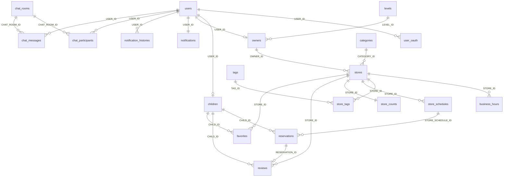

# ERD (onharu-backend-v2)

본 문서의 테이블·관계는 **`com.backend.onharu.domain` 의 JPA 엔티티**(`@Table`, `@JoinColumn`, `@ManyToOne` 등)를 근거로 정리했다.  
저장소의 `src/main/resources/static/sql/create-database-schema.sql` 은 **DB 생성 구문만** 포함하고 **전체 DDL은 없으므로**, 실제 운영 스키마는 **마이그레이션·DDL 덤프**와 엔티티를 함께 대조하는 것이 안전하다.

이전 **영화 예매(wallet, theater_seat 등)** ERD 는 **본 시스템과 무관**하다.

---

## 1. 공통 컬럼 (`BaseEntity`)

대부분의 엔티티는 `BaseEntity` 를 상속한다.

| 컬럼 (관례) | 설명 |
|-------------|------|
| `id` | PK, `IDENTITY` |
| `created_at`, `updated_at` | JPA Auditing |
| `created_by`, `updated_by` | JPA Auditing |

아래 Mermaid 블록에는 **업무 식별자·FK 위주**만 적었고, 공통 감사 컬럼은 생략했다.

---

## 2. 엔티티 관계도 (전체)

- **`files`**: 물리 FK 없이 `ref_type` + `ref_id` 로 게시물(가게·리뷰 등)에 논리 연결한다.
- **`EMAIL_AUTHENTICATION`**: 이메일 인증 코드 저장용으로, 다른 테이블과 JPA 연관 매핑이 없다.

---

## 3. 테이블 요약

| 테이블명 | 엔티티 | 설명 |
|----------|--------|------|
| `users` | `User` | 로그인·역할·상태·제공자(로컬/소셜) |
| `user_oauth` | `UserOAuth` | 소셜 연동(USER_ID → users) |
| `children` | `Child` | 결식 아동 프로필(users 1:1) |
| `owners` | `Owner` | 사업자 프로필(users 1:1, LEVEL_ID → levels) |
| `levels` | `Level` | 사업자 등급 |
| `categories` | `Category` | 가게 카테고리 |
| `stores` | `Store` | 가게(OWNER_ID, CATEGORY_ID) |
| `business_hours` | `BusinessHours` | 요일별 영업시간 |
| `tags` | `Tag` | 태그 마스터 |
| `store_tags` | `StoreTag` | 가게–태그 N:M |
| `store_counts` | `StoreCount` | 조회수·찜 수 등(STORE_ID PK/FK 1:1) |
| `store_schedules` | `StoreSchedule` | 예약 가능 일정 슬롯 |
| `reservations` | `Reservation` | 예약(CHILD_ID, STORE_SCHEDULE_ID, STATUS …) |
| `reviews` | `Review` | 감사 리뷰(RESERVATION_ID 유니크, CHILD_ID, STORE_ID) |
| `favorites` | `Favorite` | 찜(CHILD_ID+STORE_ID 유니크) |
| `notifications` | `Notification` | 사용자 알림 설정(users 1:1) |
| `notification_histories` | `NotificationHistory` | 알림 발송/히스토리 |
| `chat_rooms` | `ChatRoom` | 채팅방 |
| `chat_participants` | `ChatParticipant` | 채팅 참가(CHAT_ROOM_ID+USER_ID 유니크) |
| `chat_messages` | `ChatMessage` | 메시지(CHAT_ROOM_ID, USER_ID 발신) |
| `outbox_events` | `OutboxEvent` | Kafka 발행 대기 페이로드(트랜잭션 아웃박스; 채팅 테이블과 FK 없음) |
| `files` | `File` | 파일 메타(ref_type, ref_id, file_key …) |
| `EMAIL_AUTHENTICATION` | `EmailAuthentication` | 이메일 인증 |

---

## 4. 제약·인덱스 (엔티티 어노테이션 기준)

- **찜**: `favorites` — `(CHILD_ID, STORE_ID)` 유니크 (`UK_FAVORITE_CHILD_STORE`).
- **리뷰**: `reviews` — `RESERVATION_ID` 유니크(예약당 1리뷰).
- **채팅 참가**: `chat_participants` — `(CHAT_ROOM_ID, USER_ID)` 유니크 (`UK_CHAT_ROOM_USER`).
- **가게 집계**: `store_counts` — `STORE_ID` 가 PK 겸 FK.

---

## 5. 관련 문서

- 도메인 개념: `docs/DOMAIN_ARCHITECTURE.md`
- 클래스 연관: `docs/CLASS_DIAGRAM.md`
