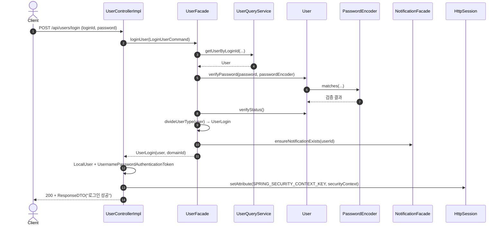
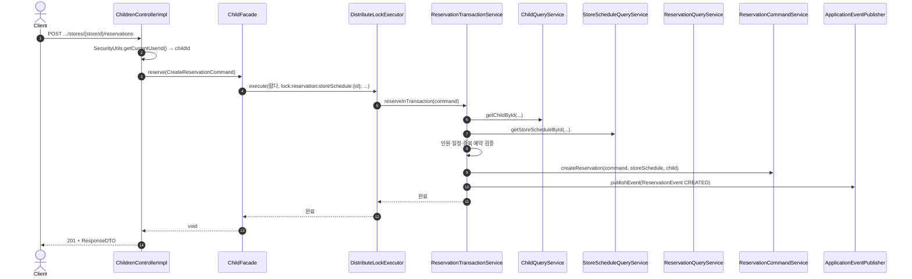
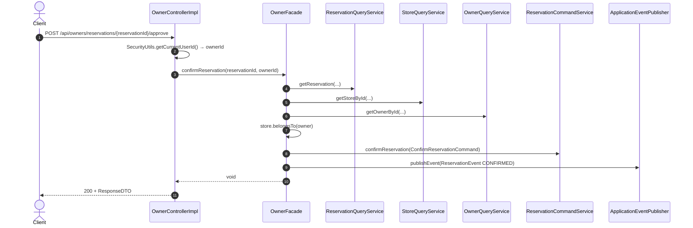
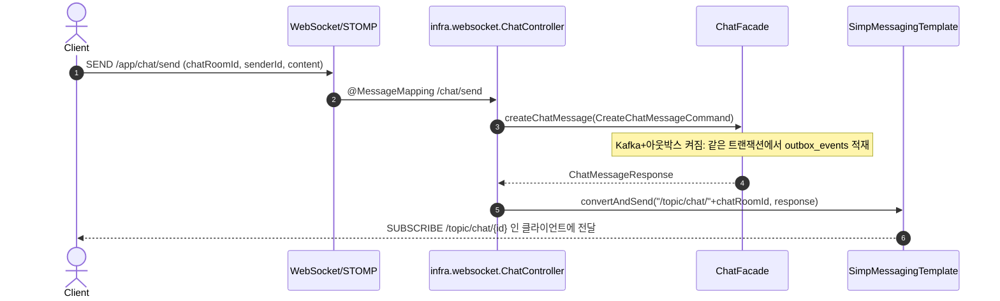

# 시퀀스 다이어그램 (onharu-backend-v2)

본 문서는 **저장소에 실제로 존재하는 호출 흐름**을 기준으로, 대표 유스케이스별 **성공 경로**를 Mermaid 시퀀스로 정리한다.  
이전 **영화 예매·대기열·좌석·결제** 시나리오는 **본 백엔드와 무관**하므로 제거했다.

HTTP 경로·메서드는 `docs/API_SPEC.md` 를 참고한다.

---

## 1. 로컬 로그인 (`POST /api/users/login`)

`UserControllerImpl` 이 **`UserFacade.loginUser`** 로 사용자·비밀번호를 검증한 뒤, **`SecurityContext`** 를 만들어 **HTTP 세션**에 저장한다 (`HttpSessionSecurityContextRepository.SPRING_SECURITY_CONTEXT_KEY`).

---

## 2. 아동 가게 예약 (`POST /api/childrens/stores/{storeId}/reservations`)

`ChildFacade.reserve` 는 **스케줄 ID 단위 분산 락**(`DistributeLockExecutor`) 안에서 **`ReservationTransactionService.reserveInTransaction`** 을 호출한다. 트랜잭션은 **`REQUIRES_NEW`** 로 락과 순서를 맞춘다.

---

## 3. 사업자 예약 확정 (`POST /api/owners/reservations/{reservationId}/approve`)

사업자 ID는 **`SecurityUtils.getCurrentUserId()`** 로 얻고, `OwnerFacade.confirmReservation` 에서 **가게 소유권**을 검증한 뒤 예약 상태를 바꾸고 **도메인 이벤트**를 발행한다.

---

## 4. 채팅 메시지 전송 (STOMP — `MessageMapping` `/chat/send`)

REST가 아니라 **WebSocket(STOMP)** 이다. 클라이언트는 **애플리케이션 목적지 prefix** `/app` 을 붙여 `/app/chat/send` 로 보낸다 (`WebSocketConfiguration`). 서버는 처리 후 **`/topic/chat/{chatRoomId}`** 로 브로드캐스트한다.

Kafka 로의 전송은 **STOMP 이후 비동기**이며, 기본은 **아웃박스 릴레이**(`OutboxRelayScheduler` → 브로커)이다. 아웃박스를 끈 경우에만 `ChatController` 가 `EventPublisher` 로 즉시 발행한다. 흐름·설정은 `docs/chat-kafka-flow.md` 참고.

---

## 5. 참고

- **예약 취소(아동)** 는 `ChildFacade.cancelReservation` → `ReservationCommandService` → `ReservationEvent`(취소) 로 이어지며, 상세 분기는 `ChildFacade`·`ReservationCommandService` 소스를 본다.
- **예외** 응답 형식은 `ApiControllerAdvice`·`ErrorResponse` (`docs/API_SPEC.md` 공통 규약) 와 동일하다.
