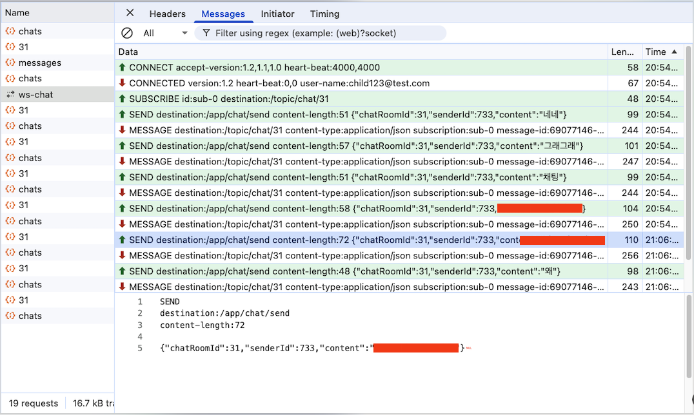

# STOMP(WebSocket) 채팅 인터페이스

## Chat (REST) — `ChatControllerImpl` 베이스 `/api/chats`

| Method | Path | 설명 |
|--------|------|------|
| `POST` | `/api/chats` | 채팅방 생성 |
| `POST` | `/api/chats/{chatRoomId}/participants` | 초대 |
| `PATCH` | `/api/chats/{chatRoomId}` | 방 이름 수정 |
| `POST` | `/api/chats/{chatRoomId}/read` | 읽음 처리 |
| `GET` | `/api/chats` | 내 채팅방 목록 |
| `GET` | `/api/chats/{chatRoomId}/messages` | 채팅방 메시지 조회 |
| `DELETE` | `/api/chats/{chatRoomId}` | 퇴장 |
| `POST` | `/api/chats/{chatRoomId}` | 입장 |


```js
// 1. 서버의 대문 주소로 연결 요청을 보냅니다.
const socket = new WebSocket("ws://localhost:8080/ws-chat");

// 2. STOMP라는 메신저 규격을 덧씌웁니다. (더 편하게 채팅하려고)
const stompClient = Stomp.over(socket);

// 3. 연결 성공! 이제부터 실시간 대화 가능
stompClient.connect({}, function (frame) {
    console.log('연결됨: ' + frame);
    
    // 특정 채팅방의 소식을 듣기 시작 (구독)
    stompClient.subscribe('/sub/chat/room/1', function (message) {
        showGreeting(JSON.parse(message.body).content);
    });
});
```

## 코드 흐름 설명
```
모달 열기
  └─ loadChatRooms()          ← GET /api/chats (목록)
       └─ 채팅방 클릭
            └─ openChatRoom()
                 ├─ loadMessages()     ← GET /api/chats/{id}/messages (REST, 커서 기반)
                 │    └─ 스크롤 상단 도달 시 더 불러오기 (페이징)
                 └─ connectStomp()     ← ws:// 연결
                      └─ subscribe /topic/chat/{id}
                           └─ 새 메시지 수신 → renderMessages()

전송 버튼 / Enter
  └─ sendChatMessage()
       └─ stompClient.publish /app/chat/send
```


### 📡 STOMP 실시간 채팅 전체 통신 로그 분석


이 로그는 클라이언트와 서버가 처음 만나 연결을 맺고(Handshake), 채팅방에 입장하여(Subscribe), 실시간으로 메시지를 주고받는(Send/Message) **전체 생명 주기(Life Cycle)**를 보여줍니다.

#### 1. 주요 명령어(Command) 및 단계별 설명
* **`↑ CONNECT`**: 클라이언트가 서버에 웹소켓 연결을 요청하는 첫 인사입니다.
* **`↓ CONNECTED`**: 서버가 연결을 승인하고 사용자의 정보(예: `child123@test.com`)를 확인한 상태입니다.
* **`↑ SUBSCRIBE`**: 연결 직후 클라이언트가 특정 채팅방(`/topic/chat/31`)을 구독합니다. 이제 이 방에서 발생하는 모든 소식을 실시간으로 들을 준비가 끝났습니다.
* **`↑ SEND` (초록색)**: 사용자가 메시지를 작성해 서버의 `/app/chat/send` 주소로 전송한 기록입니다.
* **`↓ MESSAGE` (빨간색)**: 서버가 보낸 메시지를 내가 최종적으로 '배달'받은 순간입니다. 서버가 DB 저장 등의 처리를 마친 후, 해당 방의 모든 구독자에게 데이터를 뿌려준 것입니다.

#### 2. 실시간 데이터 흐름 (Publish-Subscribe 모델)
1. **구독(SUBSCRIBE)**: 사용자가 31번 채팅방에 입장하여 수신 대기 상태가 됩니다.
2. **발행(SEND)**: 발신자(ID: 733)가 "안돼"라는 메시지를 서버로 던집니다.
3. **처리(Spring)**: 서버가 메시지를 낚아채 DB에 저장하고 고유 번호(`chatMessageId: 419`)를 생성합니다.
4. **전달(MESSAGE)**: 서버가 가공된 데이터를 JSON 형태로 31번 방의 모든 사람에게 실시간 배달합니다.

#### 3. 수신 데이터 구조 분석 (JSON)
이미지 하단 상세 패널에 표시된 실제 응답 데이터의 의미는 다음과 같습니다.

| 필드명 | 의미 | 예시 값 |
| :--- | :--- | :--- |
| **`chatMessageId`** | 서버 DB에 저장된 메시지의 고유 번호 | `419` |
| **`sender`** | 메시지를 보낸 사용자의 고유 ID | `733` |
| **`content`** | 실제 전송된 대화 내용 | `"안돼"` |
| **`createdAt`** | 서버에서 기록한 메시지 생성 시각 | `2026-04-17...` |

---
> **💡 분석 결과**: `CONNECTED` 상태가 안정적으로 유지되고 있으며, 사용자의 `SEND` 요청 이후 즉시 서버로부터 `MESSAGE` 응답이 돌아오는 것으로 보아 **실시간 양방향 통신이 지연 없이 완벽하게 작동**하고 있습니다.