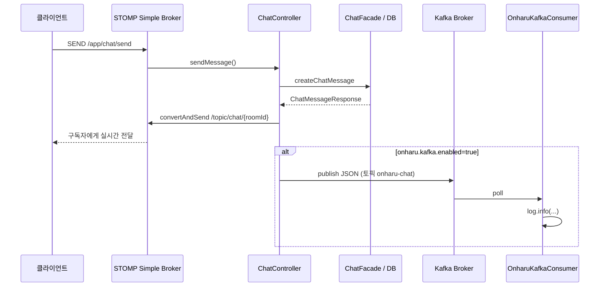

# Onharu 채팅 + Kafka 동작 설명

이 문서는 **실시간 채팅(STOMP/WebSocket)** 과 **Kafka** 가 코드에서 어떻게 이어지는지, 한 흐름으로 정리한 것입니다.

---

## 1. 큰 그림: 두 가지 “배달”이 있다

채팅 메시지가 들어오면 서버는 **서로 다른 두 통로**를 씁니다.

| 구분 | 기술 | 역할 |
|------|------|------|
| **실시간 화면 반영** | STOMP + 인메모리 Simple Broker | 같은 채팅방에 접속한 클라이언트에게 **즉시** 메시지 브로드캐스트 |
| **이벤트 기록·후처리** | Apache Kafka | 메시지 내용을 **토픽에 적재**해, 다른 서비스·배치·분석으로 확장 가능하게 함 |

Kafka는 “채팅 화면을 그리는 유일한 경로”가 **아닙니다**.  
화면은 STOMP로 가고, Kafka는 **같은 사건을 복제해 이벤트 스트림으로 남기는** 용도에 가깝습니다. (현재 Consumer는 로그 확인·향후 확장용입니다.)

---

## 2. STOMP 쪽: 클라이언트가 메시지를 보내는 경로

경로 규칙은 `ChatStompDestination` 에 모여 있습니다.

- **WebSocket 연결(핸드셰이크)**  
  - 엔드포인트: `/ws-chat`  
  - 설정: `WebSocketConfiguration.registerStompEndpoints`

- **클라이언트 → 서버 (채팅 전송)**  
  - **Destination**: `/app/chat/send`  
  - `APP_PREFIX`(`/app`) + `MESSAGE_MAPPING_CHAT_SEND`(`/chat/send`)  
  - 서버의 `ChatController.sendMessage` 가 `@MessageMapping` 으로 이 요청을 받습니다.

- **서버 → 클라이언트 (방 안 브로드캐스트)**  
  - **Destination**: `/topic/chat/{chatRoomId}`  
  - `ChatController` 가 `SimpMessagingTemplate.convertAndSend` 로 이 주소에 보내면,  
    그 방을 **subscribe** 한 모든 세션에 메시지가 갑니다.

즉, **“채팅 한 번 보내기”의 사용자 관점 흐름**은 대략 다음과 같습니다.

1. WebSocket으로 `/ws-chat` 연결  
2. STOMP로 `/app/chat/send` 에 메시지 전송 (JSON 등 — `ChatMessageRequest` 형식에 맞게)  
3. 서버가 DB 저장 후 `/topic/chat/{chatRoomId}` 로 응답 브로드캐스트  
4. (Kafka 켜져 있으면) 같은 내용을 Kafka 토픽으로도 발행  

---

## 3. 서버 내부 처리 순서 (`ChatController`)

`sendMessage` 가 호출되면 순서는 다음과 같습니다.

1. **로그**  
   - 메시지 전송 요청 로그

2. **비즈니스 + DB (`ChatFacade`)**  
   - `CreateChatMessageCommand` 로 채팅방 ID, 발신자 ID, 내용을 넘겨 메시지 생성·저장  
   - 결과로 `ChatMessageResponse` (화면에 줄 DTO) 획득

3. **실시간 브로드캐스트 (STOMP)**  
   - `messagingTemplate.convertAndSend("/topic/chat/{chatRoomId}", response)`  
   - 이 단계에서 **연결된 클라이언트**가 실시간으로 새 메시지를 받습니다.

4. **Kafka 발행 (선택)**  
   - `onharu.kafka.enabled=true` 일 때만 `OnharuKafkaProducer` 빈이 존재  
   - `ObjectProvider<OnharuKafkaProducer>` 로 “빈이 있을 때만” `publishChatEvent` 호출  
   - JSON 문자열로 직렬화한 뒤 `producer.publish(payload)` 호출

Kafka 직렬화 필드 예시 (코드 기준):

- `chatRoomId`, `chatMessageId`, `senderId`, `content`, `createdAt` (문자열)

---

## 4. Kafka Producer: 무엇을 어디로 보내는가

- **클래스**: `OnharuKafkaProducer`  
- **조건**: `@ConditionalOnProperty(name = "onharu.kafka.enabled", havingValue = "true")`  
- **토픽**: `spring.kafka.template.default-topic` → 설정상 기본값 **`onharu-chat`**  
- **브로커 주소**: `spring.kafka.bootstrap-servers` → 기본 **`localhost:9092`** (환경변수 `KAFKA_BOOTSTRAP_SERVERS` 로 변경 가능)

발행은 `KafkaTemplate` 을 사용하며, 전송 결과는 비동기로 로그에 남습니다 (`sendAndLog`).

---

## 5. Kafka Consumer: 지금은 무엇을 하나

- **클래스**: `OnharuKafkaConsumer`  
- **조건**: Producer 와 동일하게 `onharu.kafka.enabled=true` 일 때만 빈 등록  
- **구독 토픽**: Producer 와 동일하게 `spring.kafka.template.default-topic` (`onharu-chat`)  
- **그룹**: `spring.kafka.consumer.group-id` (기본 `onharu-group`)  
- **현재 동작**: 수신한 메시지와 헤더를 **로그로 출력** (`log.info`)  
- **주석상 의도**: 이후 읽음 처리·알림·분석 등 **비동기 후처리**로 확장하기 위한 자리

같은 애플리케이션 안에서 Producer가 보낸 메시지를 Consumer가 다시 받아 로그만 찍는 구조이므로, **로컬에서 “Kafka까지 도는지” 확인**할 때 유용합니다.

---

## 6. 설정과 스위치 (`application-kafka.yaml`)

`application-dev.yaml` 등에서 `optional:application-kafka.yaml` 을 import 하면 Kafka 관련 속성이 합쳐집니다.

핵심만 정리하면:

- **`onharu.kafka.enabled`**  
  - `${ONHARU_KAFKA_ENABLED:false}` 형태로 두면, 환경변수 미설정 시 **기본은 false** 에 가깝게 동작하도록 맞출 수 있습니다.  
  - (실제 YAML 내용은 배포본마다 다를 수 있으니, **현재 레포의 `application-kafka.yaml` 을 기준**으로 확인하세요.)

- **`ONHARU_KAFKA_ENABLED=true`**  
  - Kafka 관련 `@Configuration` / `@Component` 가 활성화됩니다.

- **`KafkaProducerConfig`**  
  - 역시 `onharu.kafka.enabled=true` 일 때만 로드되어 `KafkaTemplate`, ConsumerFactory, `kafkaListenerContainerFactory` 등을 등록합니다.

- **애플리케이션 메인**  
  - `OnharuApplication` 에서 `KafkaAutoConfiguration` 을 제외하고, `infra.kafka` 패키지의 수동 설정만 쓰는 패턴입니다.

---

## 7. 흐름도 (요약)

---

## 8. 자주 헷갈리는 점

1. **Kafka가 꺼져 있어도 채팅이 되나?**  
   - STOMP 브로드캐스트와 DB 저장은 **Kafka와 무관**합니다.  
   - `onharu.kafka.enabled=false` 이면 Producer/Consumer 빈이 없고, Kafka 전송만 생략됩니다.

2. **Kafka만 켜면 되나?**  
   - 브로커가 떠 있어야 하고, 앱 설정에서 `onharu.kafka.enabled=true` (또는 `ONHARU_KAFKA_ENABLED=true`) 가 맞아야 합니다.  
   - 로컬에서는 `docker-compose.kafka.yaml` 등으로 Zookeeper + Kafka 를 띄우는 방식을 쓸 수 있습니다.

3. **왜 `ObjectProvider<OnharuKafkaProducer>` 인가?**  
   - Kafka가 꺼진 설정에서는 `OnharuKafkaProducer` 빈이 **아예 없기 때문**에, 필수 주입만 하면 기동이 실패합니다.  
   - `ifAvailable` 로 “있을 때만” 발행합니다.

---

## 9. STOMP + 인메모리 Simple Broker: 무엇을 하고, 언제 한계가 오나

이 프로젝트는 `WebSocketConfiguration` 에서 `enableSimpleBroker` 로 **Spring 기본 Simple Broker** 를 씁니다. 여기서 말하는 **“인메모리”**는 채팅 내용을 RAM에 무한히 쌓는다는 뜻이 **아닙니다**.

### 9.1 메모리에서 실제로 하는 일

- 클라이언트가 `/topic/chat/{chatRoomId}` 등을 **구독**하면, 그 정보가 **해당 Spring 프로세스(JVM) 안**에 유지됩니다.
- 서버가 `convertAndSend("/topic/chat/{id}", msg)` 하면, **그 인스턴스에 붙어 있는 WebSocket 세션·구독자에게만** 메시지를 라우팅합니다.
- 브로커는 메시지를 **디스크에 오래 보관하는 저장소**가 아니라, “지금 연결된 클라이언트로 보내기 위한 라우팅”에 가깝습니다.
- **채팅 영구 저장**은 Simple Broker가 아니라 **`ChatFacade` + DB** 쪽에서 이루어집니다.

정리하면, **인메모리 = 그 서버 인스턴스 내부용 가벼운 메시지 허브**라고 보면 됩니다.

### 9.2 사용자 급증·다중 서버에서의 이슈

**한 대만 운영할 때**

- 동시 **WebSocket 연결 수**, **초당 메시지 처리량**, **스레드·파일 디스크립터** 등 **단일 노드 한계**에 걸릴 수 있습니다. (이것은 Simple Broker만의 문제가 아니라 일반적인 서버 한계입니다.)

**여러 인스턴스(Pod/VM)로 수평 확장할 때**

- Simple Broker는 **인스턴스마다 독립**입니다.
- 같은 `chatRoomId`라도 사용자 A는 **서버1**, B는 **서버2**에 붙어 있으면, 서버1에서 `convertAndSend` 한 메시지가 **서버2에 연결된 B에게는 도달하지 않을 수 있습니다**.
- 이것이 STOMP + Simple Broker만으로 갈 때 흔히 말하는 **채팅 다중화의 함정**입니다.

### 9.3 “더 좋은 것”으로 바꾸는 대표 방향

트래픽이나 인스턴스 수가 늘 계획이면, 보통 **브로커를 프로세스 밖으로** 뺍니다.

| 방향 | 설명 |
|------|------|
| **외부 메시지 브로커 + STOMP 릴레이** | RabbitMQ, ActiveMQ 등에 `StompBrokerRelay` 로 연결해, 여러 앱 인스턴스가 **같은 브로커**를 바라보게 함 |
| **Redis Pub/Sub (또는 Streams)** | 방 단위 채널을 Redis로 맞추고, 각 앱이 구독해 자기 연결된 클라이언트에만 push 하는 패턴 |
| **전용 실시간 서비스** | 채팅만 담당하는 서비스를 분리 |

### 9.4 Kafka와 실시간 화면

현재 구조에서 Kafka는 **이벤트 적재·후처리·연동**에 가깝고, **밀리초 단위 방 브로드캐스트**를 Kafka만으로 완전히 대체하는 것은 지연·운영 복잡도 때문에 **채팅 UI의 주 경로**로는 잘 쓰지 않습니다. 다만 **여러 시스템에 동일 이벤트를 나눠 주는** 용도로는 적합합니다.

---

## 10. 관련 파일 빠른 목록

| 역할 | 파일 |
|------|------|
| STOMP 엔드포인트·브로커 prefix | `WebSocketConfiguration.java` |
| 목적지 경로 상수 | `ChatStompDestination.java` |
| 채팅 수신·브로드캐스트·Kafka 발행 | `ChatController.java` |
| Kafka 발행 | `OnharuKafkaProducer.java` |
| Kafka 템플릿·리스너 팩토리 | `KafkaProducerConfig.java` |
| Kafka 구독(로그) | `OnharuKafkaConsumer.java` |
| Kafka 속성 | `application-kafka.yaml` |

---

*문서 생성 시점 기준으로 코드와 설정을 맞추었습니다. 설정 기본값이 바뀌면 `application-kafka.yaml` 을 우선 확인하세요.*
